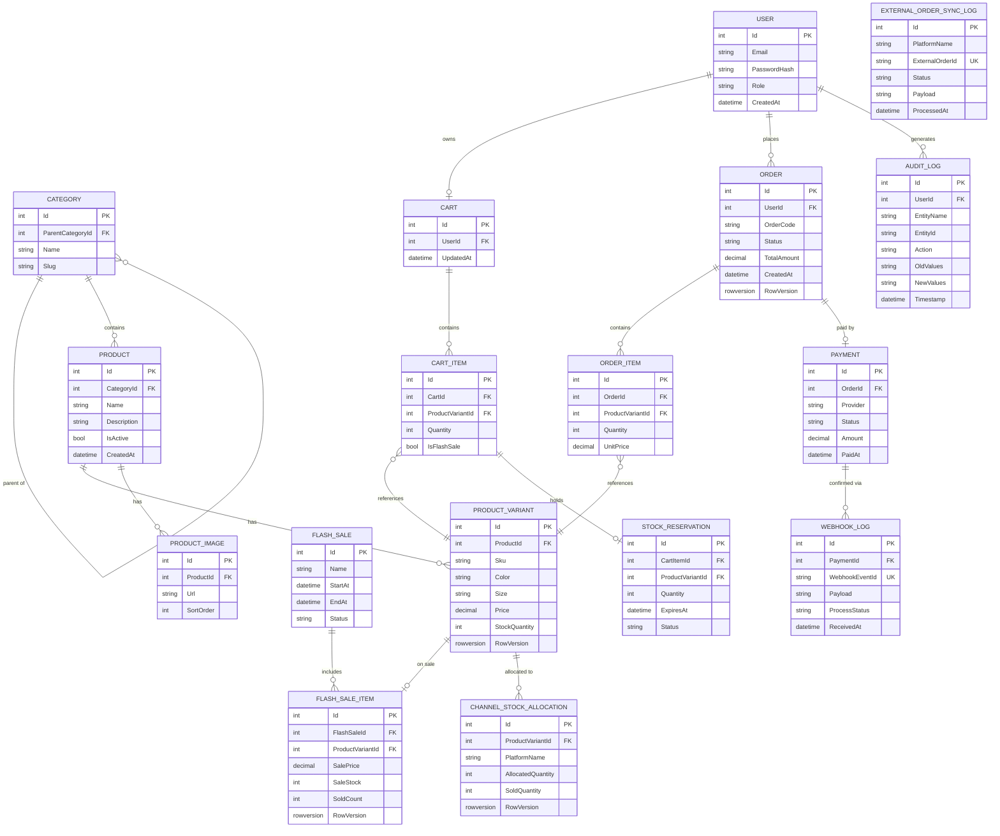

# Architecture

## Scope

### Functional Scope (Modules)
| Module | Function |
| :--- | :--- |
| **Catalog** | CRUD Category (multi-level), Product, Product Variant (SKU by color/size), Product Images |
| **Cart** | Add/edit/remove cart items, calculate total amount |
| **Flash Sale** | Admin creates sale programs (products, sale prices, limited quantities, start/end time) |
| **Inventory Reservation** | Reserve stock when adding to cart during sale, auto-release if checkout fails |
| **Order** | Create order, track status, cancel order |
| **Payment (Mock)** | Mock webhook for payment confirmation, idempotent |
| **Auth** | Registration/login, JWT, Admin/Customer role authorization |
| **Omni-Channel** | Process external webhooks (Shopee/Lazada), idempotent sync, channel stock allocation |

### Technical Scope
- **Database**: Use only 1 main database, which is **SQL Server**.
- **Caching & Lock**: Use **Redis** for Distributed Cache and Reservation Lock (not as the primary DB).
- **Architecture Pattern**: Apply **Clean Architecture** as a **Modular Monolith** in 1 Solution.
- **Message Broker**: Use **MassTransit** (configured for AWS SQS/SNS on AWS or RabbitMQ/In-Memory locally) for async workflows: 
  - Stock deduction (inventory) after order confirmation.
  - Send email/notification.

## Tech Stacks
- **Backend**: ASP.NET Core Web API, C#, Entity Framework Core
- **Frontend**: Next.js (calls API via REST)
- **Database**: SQL Server
- **Caching & Distributed Lock**: Redis
- **Message Broker**: AWS SQS / SNS (or RabbitMQ via MassTransit)
- **Architecture Design**: Modular Monolith, Clean Architecture

### Backend Core
| Component | Technology | Notes |
| :--- | :--- | :--- |
| **Framework** | ASP.NET Core 8 Web API | LTS, most stable currently |
| **Language** | C# 12 | |
| **Database** | SQL Server (LocalDB for dev, real SQL Server for deploy) | |
| **ORM** | Entity Framework Core 8 | Code-First + Migrations |
| **Cache & Distributed Lock** | Redis | StackExchange.Redis |
| **Message Queue** | AWS SQS/SNS or RabbitMQ | via MassTransit |

### NuGet Packages per layer

**ECommerce.Domain**
- *No external packages (pure POCO)*

**ECommerce.Application**
- `MediatR` — CQRS pattern
- `FluentValidation.DependencyInjectionExtensions` — validate input
- `MediatR.Extensions.Microsoft.DependencyInjection`

**ECommerce.Infrastructure**
- `Microsoft.EntityFrameworkCore.SqlServer`
- `Microsoft.EntityFrameworkCore.Tools`
- `StackExchange.Redis` — cache + reservation
- `RedLock.net` — Redis Distributed Lock
- `MassTransit`
- `MassTransit.AmazonSQS` / `MassTransit.RabbitMQ`
- `BCrypt.Net-Next` — Password Hashing
- `System.IdentityModel.Tokens.Jwt` — JWT Token Generation
- `Serilog.AspNetCore`

**ECommerce.API (E-commerce_FlashSale_Engine)**
- `Microsoft.EntityFrameworkCore.Design` — run migrations
- `Swashbuckle.AspNetCore` — Swagger UI
- `Microsoft.AspNetCore.Authentication.JwtBearer` — JWT auth
- `Asp.Versioning.Mvc` — API versioning

**Test Projects**
- `xUnit`
- `Moq`
- `FluentAssertions`
- `Microsoft.AspNetCore.Mvc.Testing`
- `Testcontainers.MsSql` / `Testcontainers.Redis`

### ***Database ERD

