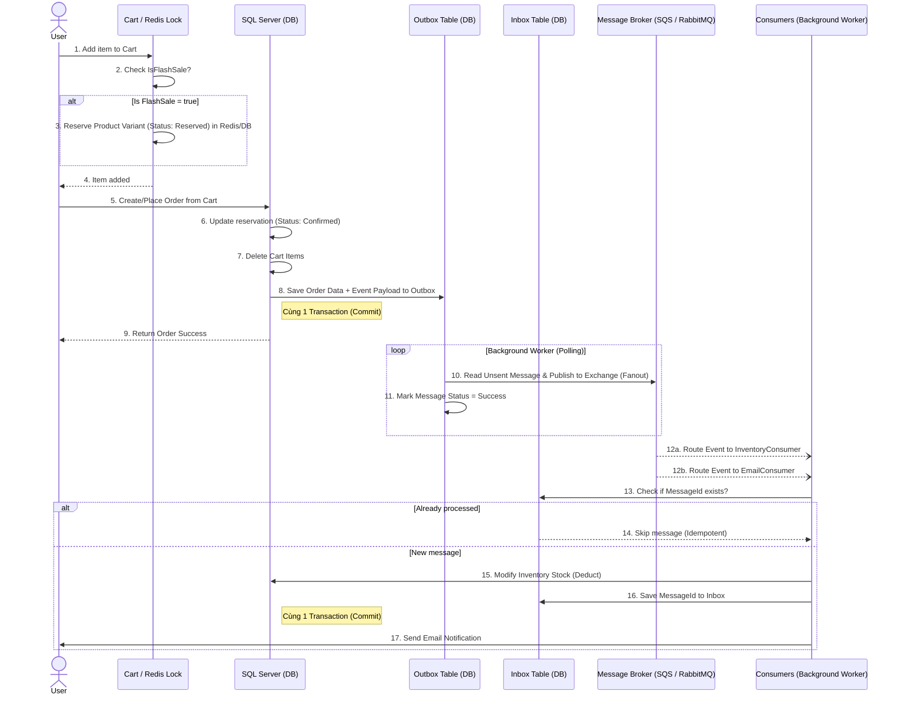

# E-Commerce FlashSale Platform

This project is a Modular Monolith E-Commerce platform built with ASP.NET Core 8, focusing on high-performance flash sale processing, omni-channel stock synchronization, and event-driven architecture using MassTransit.

## Core Workflows

### Order Placement & Event-Driven Outbox Workflow

To ensure data consistency between the database and our message broker (avoiding the Dual-Write problem), we utilize the **Transactional Outbox Pattern** provided by MassTransit for Entity Framework Core. 

1. **Cart & Reservation**: When users add items to their cart during a flash sale, the stock is temporarily reserved using a Redis Distributed Lock.
2. **Order Creation**: Upon placing an order, the system updates the reservation to 'Confirmed' and clears the cart items.
3. **Outbox Pattern**: Instead of publishing the `OrderPlacedEvent` directly to the message broker, the event is saved to an Outbox table within the exact same database transaction as the order creation. This guarantees that if the database commit succeeds, the message is durably stored.
4. **Background Delivery**: A MassTransit background worker continuously polls the Outbox table and securely publishes the pending messages to the broker (AWS SQS / RabbitMQ).
5. **Fanout & Consumption**: The broker fans out the event to multiple consumers (e.g., deducting physical inventory, sending confirmation emails) ensuring eventual consistency.

