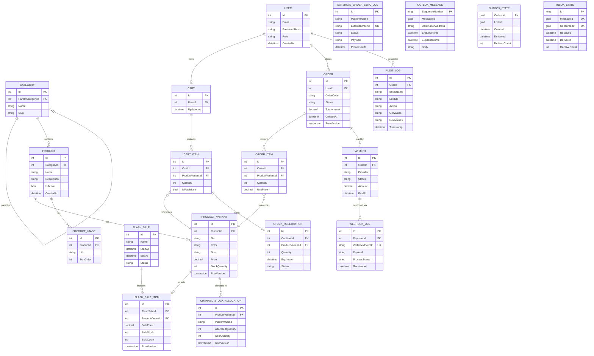
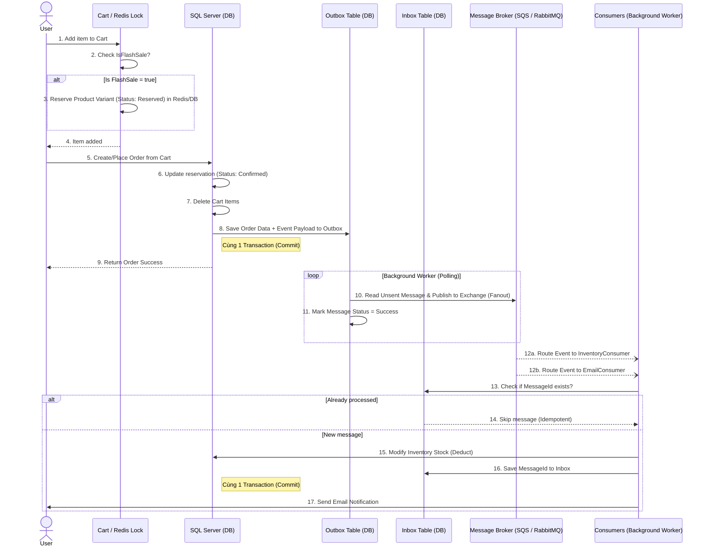

# FlashCommerce Engine

<div align="center">
  <p><strong>A high-performance, event-driven E-Commerce & Flash Sale platform built for scale.</strong></p>
  
  [](#)
  [](https://dotnet.microsoft.com/)
  [](#)
</div>

## 📖 Overview

FlashCommerce Engine is a production-ready, Modular Monolith backend designed to handle high-concurrency e-commerce workloads, particularly **Flash Sales**. By leveraging Distributed Caching, Redis Locks, and Event-Driven Architecture (MassTransit), this platform guarantees zero overselling while maintaining blazing-fast response times.

**Key Problems Solved:**
- **Overselling in Flash Sales:** Eliminated via Hybrid Redis Distributed Locks and SQL Server `rowversion` concurrency control.
- **Dual-Write Problem:** Solved using the **Transactional Outbox Pattern** to guarantee message delivery to the broker.
- **Omni-Channel Sync:** Handles Shopee/Lazada webhooks idempotently with isolated "virtual stock" buckets to prevent race conditions across platforms.

## ✨ Key Features

- **High-Concurrency Flash Sales:** Distributed locking for immediate, safe stock reservation.
- **Event-Driven Architecture:** Pub/Sub fan-out using MassTransit (supports AWS SQS/SNS, RabbitMQ).
- **Clean Architecture & CQRS:** Strictly separated layers using MediatR and FluentValidation.
- **Idempotent Webhooks:** Guaranteed exactly-once processing for payment and external platform integrations.
- **JWT Authentication & RBAC:** Secure, stateless endpoint protection.
- **Automated Integration Testing:** Full E2E flows tested using Testcontainers (ephemeral SQL & Redis).
- **k6 Concurrency & Stress Testing:** Dedicated load testing suite benchmarking Redis distributed locks, race condition resilience, and transactional outbox under heavy traffic.

## 🛠️ Tech Stack

- **Framework:** ASP.NET Core 8 Web API, C# 12
- **Database & ORM:** SQL Server, Entity Framework Core 8
- **Caching & Locks:** Redis, RedLock.net
- **Messaging:** MassTransit (AWS SQS/SNS ready, InMemory for testing)
- **Architecture:** Clean Architecture, CQRS (MediatR)
- **Testing & Benchmarking:** xUnit, FluentAssertions, Testcontainers, **Grafana k6**

## 🏗️ Architecture & Workflows

### Project Structure
```text
Backend/
├── ECommerce.Domain/         # Enterprise logic & POCO Entities
├── ECommerce.Application/    # Use cases, CQRS, DTOs, FluentValidation
├── ECommerce.Infrastructure/ # EF Core DbContext, Redis configs, MassTransit Consumers
├── E-commerce_FlashSale_Engine/ # Web API Controllers, Swagger, JWT Setup
└── ECommerce.IntegrationTests/ # E2E tests using Testcontainers
```

### Database Entity-Relationship Diagram (ERD)



### Critical Workflow: Order Placement & Event-Driven Outbox

To ensure absolute consistency without distributed transactions, we utilize the **Transactional Outbox & Inbox Patterns**:

1. **Cart & Reservation**: When users add items to their cart during a flash sale, the stock is temporarily reserved using a Redis Distributed Lock.
2. **Order Creation**: Upon placing an order, the system updates the reservation to 'Confirmed' and clears the cart items.
3. **Outbox Pattern**: Instead of publishing the `OrderPlacedEvent` directly to the message broker, the event is saved to an Outbox table within the exact same database transaction as the order creation. This guarantees that if the database commit succeeds, the message is durably stored.
4. **Background Delivery**: A MassTransit background worker continuously polls the Outbox table and securely publishes the pending messages to the broker (AWS SQS / RabbitMQ).
5. **Fanout & Consumption**: The broker fans out the event to multiple consumers (e.g., deducting physical inventory, sending confirmation emails) ensuring eventual consistency.



### Message Broker Architecture & Microservices Scalability

The platform is designed with a **Message-Driven Architecture** powered by **MassTransit**, making it highly decoupled and immediately ready to scale into a Microservices architecture if needed.

- **Infrastructure Abstraction**: Application logic does not depend on any specific message broker. MassTransit provides a unified API, allowing seamless switching between **InMemory** (local development), **RabbitMQ** (on-premise/VM), or **AWS SQS/SNS** (cloud production) by changing a single configuration line.
- **Pub/Sub and Auto-Provisioning**: When integrated with cloud-native services like AWS, the framework automatically maps Publisher events to **SNS Topics** and automatically provisions dedicated **SQS Queues** for each Consumer. It handles the subscription topology automatically upon startup.
- **True Fan-Out for Single Responsibility**: Each business side-effect is handled by an isolated Consumer class (e.g., `DeductStockOnOrderPlacedConsumer`, `SendEmailOnOrderPlacedConsumer`). This forces a 1-to-N fan-out topology (1 Topic -> N Queues).
- **Microservice Readiness**: While currently running as Background Workers (HostedServices) within a Modular Monolith, this architecture is fully portable. Individual Consumers can be physically extracted into separate autonomous Microservices or deployed as Serverless AWS Lambda functions without modifying a single line of their internal business logic.

## 🚀 Getting Started

### Prerequisites
- [.NET 8.0 SDK](https://dotnet.microsoft.com/download/dotnet/8.0)
- [Docker Desktop](https://www.docker.com/products/docker-desktop)
- Git

### Installation

1. **Clone the repository:**
   ```bash
   git clone https://github.com/yourusername/ecommerce-flashsale.git
   cd ecommerce-flashsale/Backend
   ```

2. **Start Infrastructure (Docker):**
   ```bash
   # Run Redis
   docker run -d --name flashcommerce-redis -p 6379:6379 redis:7.0
   
   # Run SQL Server (Developer Edition)
   docker run -d --name flashcommerce-sql -e "ACCEPT_EULA=Y" -e "MSSQL_SA_PASSWORD=YourStrong!Passw0rd" -p 1433:1433 mcr.microsoft.com/mssql/server:2022-latest
   ```

3. **Configure Environment Variables:**
   Update `appsettings.Development.json` in the `E-commerce_FlashSale_Engine` project:
   ```json
   {
     "ConnectionStrings": {
       "DefaultConnection": "Server=localhost,1433;Database=FlashCommerceDb;User Id=sa;Password=YourStrong!Passw0rd;TrustServerCertificate=True"
     },
     "Redis": {
       "Configuration": "localhost:6379"
     },
     "JwtSettings": {
       "Secret": "your-super-secret-key-at-least-32-bytes",
       "Issuer": "ECommerceAPI",
       "Audience": "ECommerceClient"
     }
   }
   ```

4. **Run Database Migrations:**
   ```bash
   dotnet ef database update --project ECommerce.Infrastructure --startup-project E-commerce_FlashSale_Engine
   ```

5. **Run the API:**
   ```bash
   cd E-commerce_FlashSale_Engine
   dotnet run
   ```
   Navigate to `https://localhost:7193/swagger` to explore the API.

## 💻 Usage / API Endpoints

You can test the entire flow directly in Swagger or via Postman:

- `POST /api/v1/auth/register` - Create a new user.
- `POST /api/v1/auth/login` - Authenticate and retrieve JWT token.
- `GET /api/v1/catalog/products` - Browse available products.
- `POST /api/v1/cart/items` - Add an item to the cart (triggers Redis lock for flash sales).
- `POST /api/v1/order` - Place an order (Commits SQL transaction & drops event into Outbox).
- `POST /api/v1/webhooks/payment` - Mock payment webhook (Idempotent processing).
- `POST /api/v1/webhooks/shopee/orders` - Omni-channel order sync.

## ⚡ Performance & Concurrency Load Testing (k6)

The project includes an enterprise-grade, modular **Grafana k6** load testing suite located in [`LoadTests/`](file:///d:/MyProgramme/E-Commerce_Flashsale/LoadTests) targeting every critical feature of the high-concurrency engine:

| # | Test Scenario | File | Description & Stress Target |
|:---|:---|:---|:---|
| **01** | **Auth Flow** | [`01_auth.test.js`](file:///d:/MyProgramme/E-Commerce_Flashsale/LoadTests/scenarios/01_auth.test.js) | High-throughput registration & login stress; verifies BCrypt CPU impact & JWT issuance. |
| **02** | **Catalog Read Scaling** | [`02_catalog.test.js`](file:///d:/MyProgramme/E-Commerce_Flashsale/LoadTests/scenarios/02_catalog.test.js) | High-RPS read stress on product catalog, categories, and active flash sales (`p95 < 150ms`). |
| **03** | **Cart Operations** | [`03_cart.test.js`](file:///d:/MyProgramme/E-Commerce_Flashsale/LoadTests/scenarios/03_cart.test.js) | Full cart lifecycle: user authentication, cart retrieval, item additions, and deletions. |
| **04** | **Flash Sale Lock Contention** 🔥 | [`04_flash_sale_lock.test.js`](file:///d:/MyProgramme/E-Commerce_Flashsale/LoadTests/scenarios/04_flash_sale_lock.test.js) | **Extreme Concurrency Spike**: 60+ VUs contending for the *same* limited item simultaneously. Verifies Redis Distributed Lock (`RedLock.net`), graceful 400 rejections, and **zero overselling** without 500 errors. |
| **05** | **Checkout & Outbox** | [`05_checkout.test.js`](file:///d:/MyProgramme/E-Commerce_Flashsale/LoadTests/scenarios/05_checkout.test.js) | End-to-end order placement, SQL transaction isolation, and MassTransit Outbox event dispatching. |
| **06** | **Payment Webhook Idempotency** | [`06_payment_webhook.test.js`](file:///d:/MyProgramme/E-Commerce_Flashsale/LoadTests/scenarios/06_payment_webhook.test.js) | Simulates concurrent duplicate webhook retries; asserts exactly 1 success and duplicate suppression (`already_processed`). |
| **07** | **Omni-Channel Sync** | [`07_omnichannel.test.js`](file:///d:/MyProgramme/E-Commerce_Flashsale/LoadTests/scenarios/07_omnichannel.test.js) | Shopee external webhook ingestion and allocated channel stock decrement under load. |
| **08** | **Full Flash Sale Rush** | [`08_flash_sale_rush.test.js`](file:///d:/MyProgramme/E-Commerce_Flashsale/LoadTests/scenarios/08_flash_sale_rush.test.js) | Comprehensive multi-scenario simulation: 60% Browsing, 25% Rush reservations, 10% Checkout, 5% Webhooks. |

### Running Load Tests

#### Interactive PowerShell Runner
```powershell
cd LoadTests
.\run-tests.ps1
```

#### Run Specific Test with Custom Parameters
```powershell
# Run Flash Sale Concurrency Lock test
.\run-tests.ps1 -Test 4

# Run all tests sequentially
.\run-tests.ps1 -Test all

# Override target URL and virtual users
.\run-tests.ps1 -Test 2 -BaseUrl "http://localhost:5235" -VUs 100 -Duration "30s"
```

### 📊 Live Benchmark & Stress Test Results

Executed on local production-equivalent stack (SQL Server, Redis Docker, and ASP.NET Core 8 Web API):

| Scenario | Max VUs | Total Requests | Throughput | Latency (p95) | Error Rate (5xx) | Key Concurrency Outcome |
| :--- | :---: | :---: | :---: | :---: | :---: | :--- |
| **Catalog Read Scaling** | 80 | 3,030 | ~118 req/s | **23.94 ms** | **0.00%** | Blazing-fast read performance; 100% checks passed. |
| **RedLock Flash Sale Spike** 🔥 | 60 | 489 | ~31 req/s | **162.8 ms (med)** | **0.00%** | **Zero overselling**. 21 lock-contention rejections gracefully throttled ("System is busy"); 0 deadlocks. |
| **Omni-Channel Shopee Sync** | 40 | 1,626 | ~80 req/s | **15.60 ms** | **0.00%** | Rapid webhook ingestion with dedicated stock allocation deduction and duplicate suppression. |
| **Full Rush-Hour Simulation** | 92 | 3,115 | ~121 req/s | **180.63 ms** | **0.00%** | Handled 4 concurrent user pools (Browse, Rush, Buy, Sync) simultaneously with **0 crashes**. |

> **Key takeaway:** Under extreme race conditions and traffic spikes up to 92 concurrent VUs, the system maintains **0.00% 500 server errors**, enforces **100% inventory reservation integrity** via RedLock.net, and keeps p95 latency well under **200ms**.

For more details, see [`LoadTests/README.md`](file:///d:/MyProgramme/E-Commerce_Flashsale/LoadTests/README.md).

## 🛣️ Roadmap / Future Improvements

- [x] **Frontend Storefront & Admin Portal:** Next.js (React) UI with Redux Toolkit Query & Tailwind CSS.
- [x] **k6 Concurrency & Performance Testing:** Complete suite for distributed locks, outbox, and webhooks.
- [ ] **Payment Gateway Integration:** Implement live Stripe / VNPay / MoMo webhook handlers.
- [ ] **Advanced Analytics:** Integrate ELK / OpenTelemetry stack for real-time sales dashboard tracking.
- [ ] **Kubernetes Deployment:** Helm Charts for effortless cloud-native deployment.
